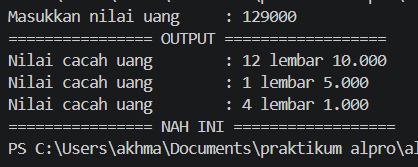

# <h1 align="center">Laporan Praktikum Modul 00 - Dasar Bahasa Pemrograman Go</h1>

<p align="center">Akhmad Nizar - 109092600018</p>

## Dasar Teori

### A. Pengenalan Dasar Bahasa Pemrograman Go

Go atau Golang adalah bahasa pemrograman prosedural yang dibuat di Google menggunakan bahasa pemrograman C oleh Robert Griesemer, Rob Pike dan Ken Thompson pada tahun 2007 dan dirilis sebagai bahasa pemrograman open source pada tahun 2009.

Golang mulai populer sejak digunakan untuk membuat Docker pada tahun 2011. Saat ini Go-Lang mulai populer untuk pembuatan Backend API pada arsitektur Microservices serta mulai banyak teknologi baru yang dibuat menggunakan bahasa Go-Lang daripada bahasa C, seperti Kubernetes, Prometheus, CockroachDB dan lain-lain.

Menurut _Irvan Eksa Mahendra. 2021_

### B. Package dan Struktur Program di Go atau Golang

#### 1. Pengertian Package main dan func main()

Setiap file program harus memiliki package. Setiap project harus ada minimal satu file dengan nama package main. File yang ber-package main, akan dieksekusi pertama kali ketika program dijalankan.

Dalam sebuah proyek harus ada file program yang di dalamnya berisi sebuah fungsi bernama main(). Fungsi tersebut harus berada di file yang package-nya bernama main.

Fungsi main() adalah yang dipanggil pertama kali pada saat eksekusi program.

Menurut _Noval Agung Prayogo. 2019_

#### 2. Deklarasi Variabel dan Tipe Data di Go

Go adalah bahasa statically typed, artinya tipe data variabel dicek saat kompilasi. Namun, Go memiliki fitur canggih bernama Type Inference.

Deklarasi Variabel

Ada dua cara umum untuk membuat variabel:

Cara 1: Deklarasi Eksplisit

Digunakan ketika Anda ingin menentukan tipe data secara manual atau mendeklarasikan tanpa nilai awal.

    var nama string = "Budi"
    var umur int = 25

Cara 2: Short Variable Declaration (:=)

Ini adalah cara paling umum di dalam fungsi. Go akan otomatis menebak tipe datanya.

    negara := "Indonesia" // Go tahu ini String
    skor := 95.5          // Go tahu ini Float64

Catatan: Di Go, jika Anda mendeklarasikan variabel tetapi tidak menggunakannya, program akan error (gagal kompilasi). Ini memaksa kode tetap bersih.

ditulis oleh _Abdullah Fawwaz Qudamah. 2026_

<!-- Tambahkan poin A, B, C, ... atau sub-topik 1, 2, 3, ... sesuai kebutuhan modul -->

## Guided

### 1. Skor.go

```go
package main

import "fmt"

func main() {
	var namaSiswa string
	var skorMtk uint8
	var skorBhsInggris uint8

	//membaca input

	fmt.Print("Masukkan nama siswa		: ")
	fmt.Scanln(&namaSiswa)
	fmt.Print("Masukkan skor Matematika	: ")
	fmt.Scanln(&skorMtk)
	fmt.Print("Masukkan skor Bahasa Inggris	: ")
	fmt.Scanln(&skorBhsInggris)

	//menghitung total skor, rata-rata, dan menampilkan output

	fmt.Println("================ DATA ==================")

	fmt.Println("Nama siswa		:", namaSiswa)
	fmt.Println("Total skor		:", skorMtk+skorBhsInggris)
	fmt.Println("Rata-rata		:", float64(skorMtk+skorBhsInggris)/2)
}
```

#### Deskripsi

Program di atas membaca input nama siswa dengan variable (string), skorMtk (uint8), dan skorBhsInggris (uint8). Kemudian program akan menghitung total dari kedua nilai variable (skorMtk, skroBhsInggris) untuk menghitung seluruh total nilai, setelah itu total nilai akan masuk ke proses pembagian ((skorMtk+skorBhsInggris)/2) guna menghitung rata - rata dari nilai atau skor siswa yang telah diinputkan.

catatan: bisa menggunakan tipe data (uint8) seperti di atas atau menggunakan (int) saja dan bisa membuat variable "totalSkor" untuk menyimpan nilai dari variable skorMtk + skorBhsInggris begitu juga dengan skor rata - rata kalian bisa menggunakan/membuat variable sendiri guna menyimpan nilai nilai rata - rata skor siswa.

### 2. tukar.go

```go
package main

import "fmt"

func main() {
	var a, b uint8

	fmt.Print("Masukkan nilai a		: ")
	fmt.Scanln(&a)
	fmt.Print("Masukkan nilai b		: ")
	fmt.Scanln(&b)

	fmt.Println("================ OUTPUT ==================")

	fmt.Println("Nilai a		:", b)
	fmt.Println("Nilai b		:", a)

	fmt.Println("================ NILAI A dan B ditukar ==================")
}

```

#### Deskripsi

Program di atas membaca nilai yang diinput ke dalam variable a (int) dan b (int) lalu menampilkan hasil inputan kita secara tertukar contoh: kita menginputkan a = 20, b = 30 hasilnya Nilai a: 30, Nilai b: 20.

### 3. lingkaran.go

```go
package main

import "fmt"

func main() {
	var r float64
	var pi float64 = 3.14

	fmt.Print("Masukkan jari-jari	: ")
	fmt.Scanln(&r)

	fmt.Println("================ OUTPUT ==================")
	fmt.Println("Luas lingkaran		:", pi*(r)*(r))
	fmt.Println("================ NAH INI ==================")
}
```

#### Deskripsi

Program di atas menghitung luas lingkaran dengan cara menghitung jari - jari yang diinputkan dan disimpan di variable "r" (float64) dengan "pi (float64). Cara menghitungnya mengikuti rmus menghitung luas lingkaran yaitu: pi _ r _. Dideklarasikan dengan kode:

    fmt.Println("Luas lingkaran		:", pi*(r)*(r))

### 3. suhu.go

```go
package main

import "fmt"

func main() {
	var celcsius float64

	fmt.Print("Masukkan celsius	: ")
	fmt.Scanln(&celsius)

	fmt.Println("================ OUTPUT ==================")

	fmt.Println("Suhu dalam Reamur	:", celsius*4/5)
	fmt.Println("Suhu dalam Fahrenheit	:", celcius*9/5+32)
	fmt.Println("Suhu dalam Kelvin	:", celsius+273.15)

	fmt.Println("================ NAH INI ==================")
}
```

#### Deskripsi

Program di atas membaca nilai celsius yang kita input lalu dikonvert mennjadi reamur, farenheit, dan kelvin. Nilai yang diinput disimpan dalan variable "celsius" (float64) lalu dikonvert menjadi beberapa jenis suhu.

Deklarasinya:

    fmt.Println("Suhu dalam Reamur	:", celsius*4/5)
    fmt.Println("Suhu dalam Fahrenheit	:", celcius*9/5+32)
    fmt.Println("Suhu dalam Kelvin	:", celsius+273.15)

## Unguided

### 1. kalkulator.go

```go
package main

import (
	"fmt"
	"math"
)

func main() {
	var a, b float64

	fmt.Print("Masukkan nilai a	: ")
	fmt.Scanln(&a)
	fmt.Print("Masukkan nilai b	: ")
	fmt.Scanln(&b)

	fmt.Println("================ OUTPUT ==================")

	fmt.Println("Hasil penjumlahan	:", a+b)
	fmt.Println("Hasil pengurangan	:", a-b)
	fmt.Println("Hasil perkalian	:", a*b)
	fmt.Println("Hasil pembagian	:", a/b)
	fmt.Println("Hasil modulo		:", math.Mod(a, b))

	fmt.Println("================ NAH INI ==================")
}
```

##### Output


#### Deskripsi

Program di atas adalah program kalkulator, dimana program membaca nilai yang kita inputkan lalu disimpan dalam variabel "a" dan "b" keduanya adalah (float64). Variable yang kita inputkan akan dieksekusi dengan metode matematika dasar seperti penjumalahan, pengurangan, perkalian, pembagian, dan sisa bagi.

### 2. cacahuang.go

```go
package main

import "fmt"

func main() {
	var nilaiUang uint64

	fmt.Print("Masukkan nilai uang	: ")
	fmt.Scanln(&nilaiUang)

	sepuluhRibu := nilaiUang / 10000
	sisa := nilaiUang % 10000

	limaRibu := sisa / 5000
	sisa = sisa % 5000

	seribu := sisa / 1000

	fmt.Println("================ OUTPUT ==================")

	fmt.Println("Nilai cacah uang	:", sepuluhRibu, "lembar 10.000")
	fmt.Println("Nilai cacah uang	:", limaRibu, "lembar 5.000")
	fmt.Println("Nilai cacah uang	:", seribu, "lembar 1.000")

	fmt.Println("================ NAH INI ==================")
}
```

##### Output



#### Deskripsi

Program di atas bertujuan untuk mencacah uang yang kita inputkan ke dalam variable "nilaiUang" (uint64) dengan cara nilaiUang dibagi 10000 lalu sisa nilaiUang dibagi sisa 10000 lalu sisa dibagi 5000 lalu sisanya dibagi hasil 5000 lalu sisa akhir dibagi 1000.

Deklarasinya:

    sepuluhRibu := nilaiUang / 10000
    sisa := nilaiUang % 10000

    limaRibu := sisa / 5000
    sisa = sisa % 5000

    seribu := sisa / 1000

## Kesimpulan

Praktikum ini bertujuan untuk mengenalkan dasar - dasar bahasa pemrograman Go dan menjelaskan bagaimana cara penggunaannya melalui beberapa latian membuat program yang ada di atas.

## Referensi

1. Irvan Eksa Mahendra. (2021). _medium.com_.
2. Noval Agung Prayogo. (2019). _dasarpemrogramangolang.novalagung.com_.
3. Abdullah Fawwaz Qudamah. (2026). _fawwaz.id_
