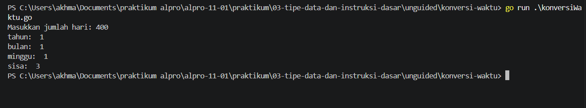

# <h1 align="center">Laporan Praktikum Modul 03 - Tipe Data dan Operator Pemrograman Go</h1>

<p align="center">Akhmad Nizar - 109092600018</p>

## Dasar Teori

### A. Pengenalan Tipe Data dan Operator di GO

Go memiliki beragam tipe data yang digunakan untuk menyimpan berbagai jenis nilai. Beberapa tipe data dasar dalam Go meliputi:

int: untuk menyimpan bilangan bulat.

float64: untuk menyimpan bilangan desimal.

string: untuk menyimpan teks.

bool: untuk menyimpan nilai boolean (true atau false).

Go mendukung berbagai operasi dasar untuk melakukan manipulasi data. Beberapa operasi dasar yang umum digunakan antara lain:

Aritmatika: Operasi untuk melakukan perhitungan matematika seperti penjumlahan, pengurangan, perkalian, dan pembagian.

Contoh:

Penugasan: Operasi untuk memberikan nilai pada variabel.

Contoh :

    x := 10

Perbandingan: Operasi untuk membandingkan dua nilai.

Contoh :

    x := 10 y := 5 fmt.Println(x > y) // Output: true

Logika: Operasi untuk melakukan operasi logika seperti AND, OR, dan NOT.

Contoh:

    x := true y := false fmt.Println(x && y) // Output: false

Concatenation: Operasi untuk menggabungkan dua string.

Contoh:

    str1 := "Hello" str2 := "World" hasil := str1 + " " + str2 // Output: "Hello World"

Menurut _Hafiyan Rizqi Sanjaya. 2024_

### B. Tipe Data dan Operator Program di Go atau Golang

#### 1. Pengertian Tipe Data dan Operator

Setiap file program harus memiliki package. Setiap project harus ada minimal satu file dengan nama package main. File yang ber-package main, akan dieksekusi pertama kali ketika program dijalankan.

Dalam sebuah proyek harus ada file program yang di dalamnya berisi sebuah fungsi bernama main(). Fungsi tersebut harus berada di file yang package-nya bernama main.

Fungsi main() adalah yang dipanggil pertama kali pada saat eksekusi program.

Menurut _Noval Agung Prayogo. 2019_

#### 2. Deklarasi Variabel dan Tipe Data di Go

Go adalah bahasa statically typed, artinya tipe data variabel dicek saat kompilasi. Namun, Go memiliki fitur canggih bernama Type Inference.

Deklarasi Variabel

Ada dua cara umum untuk membuat variabel:

Cara 1: Deklarasi Eksplisit

Digunakan ketika Anda ingin menentukan tipe data secara manual atau mendeklarasikan tanpa nilai awal.

    var nama string = "Budi"
    var umur int = 25

Cara 2: Short Variable Declaration (:=)

Ini adalah cara paling umum di dalam fungsi. Go akan otomatis menebak tipe datanya.

    negara := "Indonesia" // Go tahu ini String
    skor := 95.5          // Go tahu ini Float64

Catatan: Di Go, jika Anda mendeklarasikan variabel tetapi tidak menggunakannya, program akan error (gagal kompilasi). Ini memaksa kode tetap bersih.

ditulis oleh _Abdullah Fawwaz Qudamah. 2026_

## Guided

### 1. tukar.go

```go
package main

import "fmt"

func main() {
	var x, y, z int

	fmt.Print("Masukkan nilai x: ")
	fmt.Scanln(&x)

	fmt.Print("Masukkan nilai y: ")
	fmt.Scanln(&y)

	fmt.Print("Masukkan nilai z: ")
	fmt.Scanln(&z)

	temp := x
	x = z
	z = y
	y = temp

	fmt.Println("Nilai x setelah ditukar: ", x)
	fmt.Println("Nilai y setelah ditukar: ", y)
	fmt.Println("Nilai z setelah ditukar: ", z)
}

```

#### Deskripsi

Program di atas membaca input x, y, z lalu menukarkan nilai dari variable tersebut seperti x = z, z = y, y = x.

##### Output


### 2. konversi.go

```go
package main

import "fmt"

func main() {
	var celcius float64
	var kelvin float64

	fmt.Print("Masukkan suhu dalam Celcius: ")
	fmt.Scanln(&celcius)

	kelvin = celcius + 273
	fmt.Println("Suhu dalam Kelvin: ", kelvin)
}
```

#### Deskripsi

Program di atas membaca input celcius lalu merubahnya ke hitungan kelvin.

### 3. kasir.go

```go
package main

import "fmt"

func main() {
	var x int

	fmt.Print("Masukkan nilai x: ")
	fmt.Scanln(&x)

	var sepuluhRibu int = x / 10000
	sisa := x % 10000

	var limaRibuan int = sisa / 5000
	sisa = x % 5000

	var seribu int = sisa / 1000

	fmt.Println("Hasil: ", sepuluhRibu, limaRibuan, seribu)
}
```

#### Deskripsi

Program di atas membaca inputan dari x lalu mengubah nilai menjadi pecahan 10.000, 5.000, dan 1.000 dengan jumlah lembar tertentu. Program menggunakan operator pembagian (/) untuk menentukan jumlah pecahan dan operator modulus (%) untuk menghitung sisa nilai x.

## Unguided

### 1. koversiSuhu.go

```go
package main

import "fmt"

func main() {
	var c, r float64

	fmt.Print("Masukkan suhu dalam Celcius: ")
	fmt.Scanln(&c)

	r = (4.0 / 5.0) * c
	fmt.Println("Suhu dalam Fahrenheit: ", r)
}
```

##### Output


#### Deskripsi

Program ini membaca inputan suhu celsius (r) untuk mengubah suhu dari Celcius ke Réaumur (r).program menghitungnya dengan rumus 4/5 × Celcius dan menampilkan hasilnya.

### 2. konversiWaktu.go

```go
package main

import "fmt"

func main() {
	var hari int

	fmt.Print("Masukkan jumlah hari: ")
	fmt.Scan(&hari)

	tahun := hari / 360
	sisa := hari % 360

	bulan := sisa / 30
	sisa = sisa % 30

	minggu := sisa / 7
	sisa = sisa % 7

	fmt.Println("tahun: ", tahun)
	fmt.Println("bulan: ", bulan)
	fmt.Println("minggu: ", minggu)
	fmt.Println("sisa: ", sisa)
}
```

##### Output



#### Deskripsi

Program ini digunakan untuk mengubah jumlah hari menjadi tahun, bulan, minggu, dan sisa hari. Program menggunakan pembagian (/) dan sisa bagi (%) untuk menghitung masing-masing satuan waktu.

## Kesimpulan

Praktikum ini bertujuan untuk mengenalkan tipe data san operator bahasa pemrograman Go dan menjelaskan bagaimana cara penggunaannya melalui beberapa latian membuat program yang ada di atas.

## Referensi

1. Hafiyan Rizqi Sanjaya. (2021). _medium.com_.
2. Noval Agung Prayogo. (2019). _dasarpemrogramangolang.novalagung.com_.
3. Abdullah Fawwaz Qudamah. (2026). _fawwaz.id_
