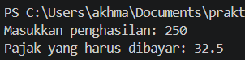

# <h1 align="center">Laporan Praktikum Modul 04 - Runtutan dan Sekuensi</h1>

<p align="center">Akhmad Nizar - 109092600018</p>

## Dasar Teori

### A. Pengenalan Runtutan dan Sekuensi di GO

Go adalah bahasa pemrograman yang memiliki runtutan dan sekuensi yang artinya bahasa pemrograman Go mengeksekusi programnya sesuai runtutan code yang telah diketik oleh programmer. Kode dieksekusi mulai dari code paling atas kecuali pada program yang kompleks seperti menggunakan if else dan switch case.

## Guided

### 1. grade.go

```go
package main

import (
	"bufio"
	"fmt"
	"os"
)

func main() {
	var nama string
	var nilai float64
	var grade string

	scanner := bufio.NewScanner(os.Stdin)

	fmt.Print("Masukkan nama: ")
	scanner.Scan()
	nama = scanner.Text()

	fmt.Print("Masukkan nilai (0-100): ")
	fmt.Scan(&nilai)

	if nilai >= 90 && nilai <= 100 {
		grade = "A"
	} else if nilai >= 80 && nilai < 90 {
		grade = "B"
	} else if nilai >= 70 && nilai < 80 {
		grade = "C"
	} else if nilai >= 60 && nilai < 70 {
		grade = "D"
	} else {
		grade = "F"
	}

	fmt.Printf("%s mendapatkan nilai %s\n", nama, grade)
}
```

#### Deskripsi

Program di atas membaca input dan memasukkannya ke dalam variable nama, nilai dan grade untuk mengeluarkan nama yang diinputkan dan mendapat grade apa, gradenya menyesuaikan dengan nilai yang diinputkan.

Berikut adalah code yang menggunakan metode if else nilai berapa lalu grade yang diberikan dari nilai tersebut:

    if nilai >= 90 && nilai <= 100 {
    	grade = "A"
    } else if nilai >= 80 && nilai < 90 {
    	grade = "B"
    } else if nilai >= 70 && nilai < 80 {
    	grade = "C"
    } else if nilai >= 60 && nilai < 70 {
    	grade = "D"
    } else {
    	grade = "F"
    }

##### Output


### 2. penilaian.go

```go
package main

import (
	"bufio" // Digunakan untuk membaca masukan string yang memiliki spasi (seperti nama lengkap)
	"fmt"
	"os" // Menyediakan akses ke sistem operasi, dalam hal ini os.Stdin yang merepresentasikan keyboard
)

func main() {
	// Pendefinisian variabel secara eksplisit beserta tipe datanya
	var pilihan int
	var nama string
	var nilai float64
	var grade string

	// Menampilkan cetakan Menu ke layar
	fmt.Println("============= Menu =============")
	fmt.Println("1. Sistem penilaian")
	fmt.Println("0. Keluar")
	fmt.Print("Pilih opsi: ")

	// Membaca masukan pilihan (angka).
	// Kita menggunakan Scanln agar saat user menekan 'Enter', karakter enter tersebut
	// ikut diolah/dibersihkan dan tidak melompat (mengganggu) masukan nama di bawahnya.
	fmt.Scanln(&pilihan)

	// Percabangan/Sekuensi bersyarat berdasarkan input pengguna
	if pilihan == 1 {
		fmt.Print("Masukkan nama siswa: ")

		// Membuat alat pembaca (scanner) baru yang mengambil masukan dari keyboard
		scanner := bufio.NewScanner(os.Stdin)

		// Proses membaca masukan dari pengguna sampai tombol Enter ditekan
		scanner.Scan()

		// Mengambil teks (nama) yang baru saja dibaca dan menyimpannya ke variabel
		nama = scanner.Text()

		fmt.Print("Masukkan nilai siswa: ")
		fmt.Scanln(&nilai)

		// Menentukan grade nilai
		if nilai >= 90 && nilai <= 100 {
			grade = "A"
		} else if nilai >= 80 && nilai < 90 {
			grade = "B"
		} else if nilai >= 70 && nilai < 80 {
			grade = "C"
		} else if nilai >= 60 && nilai < 70 {
			grade = "D"
		} else {
			grade = "F"
		}

		// %s adalah format (placeholder) untuk mencetak data bertipe string
		// %s pertama akan digantikan oleh isi variabel 'nama', %s kedua oleh 'grade'
		fmt.Printf("%s mendapatkan nilai %s\n", nama, grade)

	} else if pilihan == 0 {
		// Dijalankan jika pengguna mengetik 0
		fmt.Println("Keluar dari program.")

	} else {
		// Dijalankan jika pengguna mengetik angka selain 1 dan 0
		fmt.Println("Pilihan tidak valid.")
	}
}
```

#### Deskripsi

Program di atas sama dengan program grade.go namun dengan memasukkan input 1 atau 0, yang dimana jika user menginputkan angka 0 maka program berhenti, jika input angka 1 maka program akan dilanjutkan atau dieksekusi.

### 3. klasifikasi.go

```go
package main

import (
	"fmt" // Hanya memerlukan fmt untuk keperluan input dan output
)

func main() {
	// Pendefinisian variabel secara eksplisit beserta tipe datanya
	var usia int
	var gaji int
	var keterangan string

	// Membaca dua masukan berupa angka dari pengguna (usia dan gaji)
	// fmt.Scan otomatis memisahkan input berdasarkan spasi atau baris baru (enter)
	fmt.Scan(&usia)
	fmt.Scan(&gaji)

	// Menggunakan switch tanpa ekspresi.
	// Cara kerjanya sama persis seperti deretan if - else if.
	// Program akan mengecek dari atas ke bawah, dan menjalankan case pertama yang bernilai benar (true).
	switch {
	case usia < 18:
		keterangan = "Masih sekolah"
	case usia >= 18 && usia <= 25 && gaji >= 50:
		keterangan = "Muda sukses"
	case usia >= 18 && usia <= 25 && gaji < 50:
		keterangan = "Masih belajar hidup"
	case usia >= 26 && usia <= 40 && gaji >= 100:
		keterangan = "Pekerja mapan"
	case usia >= 26 && usia <= 40 && gaji < 100:
		keterangan = "Perlu perbaikan karier"
	case usia > 40 && gaji >= 150:
		keterangan = "Profesional berpengalaman"
	case usia > 40 && gaji < 150:
		keterangan = "Perlu evaluasi finansial"
	}

	// Menampilkan hasil klasifikasi ke layar
	fmt.Println(keterangan)
}
```

#### Deskripsi

Program di atas membaca inputan dari variable usia dan gaji lalu program akan mengeluarkan hasil yang sesuai dengan pengkondisian yang menggunakan metode switch case.

Berikut adalah code dari switch casenya:

    switch {
    case usia < 18:
    	keterangan = "Masih sekolah"
    case usia >= 18 && usia <= 25 && gaji >= 50:
    	keterangan = "Muda sukses"
    case usia >= 18 && usia <= 25 && gaji < 50:
    	keterangan = "Masih belajar hidup"
    case usia >= 26 && usia <= 40 && gaji >= 100:
    	keterangan = "Pekerja mapan"
    case usia >= 26 && usia <= 40 && gaji < 100:
    	keterangan = "Perlu perbaikan karier"
    case usia > 40 && gaji >= 150:
    	keterangan = "Profesional berpengalaman"
    case usia > 40 && gaji < 150:
    	keterangan = "Perlu evaluasi finansial"
    }

##### Output


## Unguided

### 1. grade.go

```go
package main

import (
	"bufio"
	"fmt"
	"os"
)

func main() {
	var nama string
	var nilai float64
	var grade string

	scanner := bufio.NewScanner(os.Stdin)

	fmt.Print("Masukkan nama: ")
	scanner.Scan()
	nama = scanner.Text()

	fmt.Print("Masukkan nilai (0-100): ")
	fmt.Scan(&nilai)

	switch {
	case nilai >= 90 && nilai <= 100:
		grade = "A"
	case nilai >= 80 && nilai < 90:
		grade = "B"
	case nilai >= 70 && nilai < 80:
		grade = "C"
	case nilai >= 60 && nilai < 70:
		grade = "D"
	default:
		grade = "F"
	}

	fmt.Printf("%s mendapatkan nilai %s\n", nama, grade)
}

```

##### Output


#### Deskripsi

Program di atas membaca input dan memasukkannya ke dalam variable nama, nilai dan grade untuk mengeluarkan nama yang diinputkan dan mendapat grade apa, gradenya menyesuaikan dengan nilai yang diinputkan. Sama seperti program grade.go yang ada di "guided" namun kali ini menggunakan switch case.

Berikut adalah code yang menggunakan metode switch case nilai berapa lalu grade yang diberikan dari nilai tersebut:

    switch {
    case nilai >= 90 && nilai <= 100:
    	grade = "A"
    case nilai >= 80 && nilai < 90:
    	grade = "B"
    case nilai >= 70 && nilai < 80:
    	grade = "C"
    case nilai >= 60 && nilai < 70:
    	grade = "D"
    default:
    	grade = "F"
    }

### 2. pajak.go

```go
package main

import "fmt"

func main() {
	var penghasilan, pajak float64

	fmt.Print("Masukkan penghasilan: ")
	fmt.Scan(&penghasilan)

	if penghasilan <= 50 {
		pajak = 5.0 / 100 * penghasilan
	} else if penghasilan <= 100 {
		pajak = (5.0 / 100 * 50) +
			(10.0 / 100 * (penghasilan - 50))
	} else if penghasilan <= 200 {
		pajak = (5.0 / 100 * 50) +
			(10.0 / 100 * 50) +
			(15.0 / 100 * (penghasilan - 100))
	} else {
		pajak = (5.0 / 100 * 50) +
			(10.0 / 100 * 50) +
			(15.0 / 100 * 100) +
			(20.0 / 100 * (penghasilan - 200))
	}

	fmt.Printf("Pajak yang harus dibayar: %.1f\n", pajak)
}
```

##### Output



#### Deskripsi

Program di atas membaca input penghasilan dari user lalu dihitung untuk untuk menentukan pajak yang diberikan.

## Kesimpulan

Praktikum ini bertujuan untuk memahami runtutan, sekuensi dan cara koding seperti switch case dan if else.

## Referensi

1. Hafiyan Rizqi Sanjaya. (2021). _medium.com_.
2. Noval Agung Prayogo. (2019). _dasarpemrogramangolang.novalagung.com_.
3. Abdullah Fawwaz Qudamah. (2026). _fawwaz.id_
